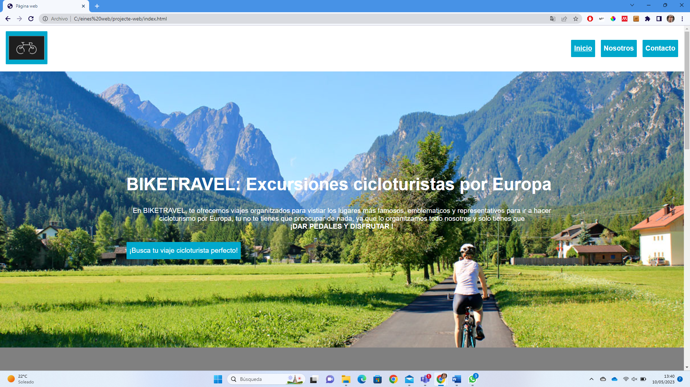

# README #

Visita la web de **BIKETRAVEL**: [https://ddermit.github.io/biketravel-web/)

## 1 Tema/motivación.

Se trata de una web creada para una empresa que organiza viajes en bicicleta por Europa a lugares emblemáticos del mundo del cicloturismo. La idea está basada en que en el Garraf hay una empresa que realiza este tipo de viajes y siempre me ha gustado lo que hacen, estaría encantado de trabajar o crear una similar. 

## 2 Datos/contenidos.

Los datos y textos de la web son elaboración propia principalmente, aunque he tomado algunas ideas de diferentes agencias de viajes o comunidades viajeras de internet que me ha aportado gran información de las rutas y sitios populares de los países que menos conocía como es el caso de Alemania. Lo que no se elaboración propia son las imágenes, que las he buscado en internet intentando cumplir al máximo que estén libres de derechos de imagen. Hay que añadir que para realizar el mapa he utilizado la web wikiloc de la cual, he extraído todos los tracks que se ven en el mapa de la página web y se pueden visualizar en el enlace linkado en los "pop-ups".

## 3 Estructura de la Web.

La web está estructurada con una página principal, con información relevante de empresa Biketravel y después dispondríamos las siguientes secciones:

- Galería: En esta sección encontramos fotografías representativas de los lugares donde se realizan las excursiones ciclistas que realiza la empresa. Cuando paseas por la fotografía aparece un efecto zoom y aparece el título del lugar.
- Mapa: En este encontramos el mapa donde representamos los principales lugares donde se realizan las salidas o viajes organizados y además se han mostrado un recorrido propuesto en rojo. A demás, haciendo clic en el icono emerge un "pop-up" donde se observa una fotografia del lugar y un enlace para acceder a la página de wikiloc y asi disponer de más información.
- Nosotros: lo que encontramos en este apartado de la web es una pequeña explicación de lo que es la empresa, a la que se dedica, los servicios que ofrece y también se ha generado una tabla para mostrar los precios de las excursiones con los diferentes packs y paises.
- Contacto: en este apartado se dispone de un formulario breve para ponerse en contacto y realizar cualquier pregunta en la empresa.

Para concluir la explicación es necesario recalcar que en todo momento si clicas en el logo te lleva a la página de inicio, la cabecera está vinculada en todo momento con las páginas que le corresponden y por último, todas disponen, en la parte inferior de la página, de un boto que te lleva a lo más alto.

## 4 Web responsive.

La técnica empleada ha sido principalmente dividir la página en columnas y adaptarlas el tamaño de la página. Considero que la página se ajusta correctamente a tamaños de pantalla grandes y medios pero a tamaño de móvil me ha surgido alguna que otra dificultad y la adaptación o la web no es del todo responsiva.

## 5 Cartografía.

El mapa que encontrará en la web elaborado se ha realizado mediante la base de google maps hibrida en la que se han georeferenciado mediante una capa de punto los lugares escogidos como destino turístico para ciclistas. Sobre estos puntos se ha modificado el icono personalizándolo con una imagen svg de una bicicleta para hacer más atractivo el mapa. Por último en cuanto a los puntos de los polígonos, se ha modificado la tabla de atributos sumando una columna "imagen" y otro "enlace" para que cuando el usuario clique en el icono, salga un "pop up" con el nombre del sitio, una fotografía representativa y un enlace al wikiloc para que pueda visualizar los datos de la ruta propuesta.
Paralelamente se ha ido al wikiloc y se han descargado unos tracks que se muestran junto con los iconos.
Destacar que el logo o los puntos representativos de España, Frnaça, Italia, Países Bajos y Alemania están en una misma capa y que los recorridos en capas diferentes ya que son tracks independientes unos de otros.

## 6 Dificultades/mejoras.

La web elaborada que es bastante biuena teniendo en cuanta que nunca hemos hecho una web y que no he utilizado ninguna plantilla excepto la del formulario de contacto. Además creo que he hecho una web atractiva visualmente y que cumple con muchos de los requisitos propuestos por los profesores.
En cuanto a las dificultades, puedo decir que me ha costado hacer la web responsiva. Lo he conseguido en pantallas grandes y medias pero no con pantalla de movil.
En cuanto a los puntos fuertes o lo que me ha costado menos, claramente ha sido el mapa y su elaboración con todos los elementos que contiene debido a que llevamos mucho más tiempo haciéndolo y ha sido bien fusionar los mapas con el diseño web.

Por último, si volviera a realizar la web, claramente mejoraría el formato responsive, elaborando la página primero con el tamaño de pantalla pequeño e ir aumentando, de hecho, seguramente utilizaria una plantilla, otro de los aspectos que sería mejorable el botón de volver al inicio, la alineación de los textos, la separación o pading y algún otro aspecto de formato para hacer aún más visual la página web.

Captura de pantalla de la pàgina web:

https://ddermit.github.io/biketravel-web/

Per buscar més rutes: 
[Click to wikiloc](https://ca.wikiloc.com)
